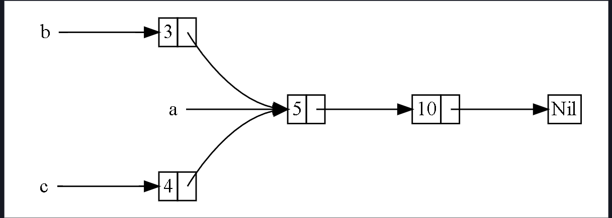

### you can declare a variables using the `let` and `const`

```rust
    let mut y = 10 ;
    y = 9;
    const x :i32 = 0;
    x = 12; // error

```

### the println

```rust
    println!("{0}, this is {1}. {1}, this is {0}", "Alice", "Bob");
    //Alice, this is Bob. Bob, this is Alice
    println!(
        "{subject} {verb} {object}",
        object = "the lazy dog",
        subject = "the quick brown fox",
        verb = "jumps over"
    );
    // the quick brown fox jumps over the lazy dog
    println!("Base 10:               {}", 69420); // 69420
    println!("Base 2 (binary):       {:b}", 69420); // 10000111100101100
    println!("Base 8 (octal):        {:o}", 69420); // 207454
    println!("Base 16 (hexadecimal): {:x}", 69420); // 10f2c
    println!("{number:>3}", number = 1); //space space space 1
    println!("{number:0>5}", number = 1); // 00001
    println!("{number:0<5}", number = 1); // 10000
    println!("{number:0>width$}", number = 1, width = 5); // 00001
```

### the `mut` key word tell rust compiler that is this variable

### i can change it's value later

### loops in rust

```rust
    for x in (1..10).step_by(2) {
        println!("{}" , x); // 1 3 5 7 9
    }
```

```rust
    for i in (-11..=0).rev().step_by(2){
        println!("{i}"); // 0 -2 -4 -6 -8 -10
    }
```

```rust
    let mut x: i32 = 0;
    loop
        x += 1;
        println!("{}", x); // 1 2 3 4 5 7 8 9 10
        if x == 10 {
            break;
        }
    }
```

```rust
    let mut x = 0;
    while x <= 10 {
        println!("{}", x);
        x += 1;
    }
```

## methods on rust

```rust
#[derive(Debug)]
struct Rectangle {
    width: u32,
    height: u32,
}

impl Rectangle {
    fn area(&self) -> u32 {
        self.width * self.height
    }
}

fn main() {
    let rect1 = Rectangle {
        width: 30,
        height: 50,
    };

    println!(
        "The area of the rectangle is {} square pixels.",
        rect1.area()
    );
}

```

## Enums in rust

```rust
enum IpAddrKind {
    V4,
    V6,
}
```

```rust
 let four = IpAddrKind::V4;
 let six = IpAddrKind::V6;
```

```rust
  enum IpAddr {
        V4(u8, u8, u8, u8),
        V6(String),
    }

    let home = IpAddr::V4(127, 0, 0, 1);

    let loopback = IpAddr::V6(String::from("::1"));
```

```rust
    let x  = 5;
    let y : Option<i8> = Some(5);

    println!("{}" , x+y.unwrap_or(1)); // sum x+y and if y = nothing the default = 1
    // output : 10
```

```rust

    let x  = 5;
    let y : Option<i8>  = None;

    println!("{}" , x+y.unwrap_or(1)); // output : 6


```

### the option type on rust work as the value of y can be `i8` or nothing

### enums with the match

```rust
enum Coin{
    Penny,
    Nickel,
    Dime,
    Quarter
}

fn main()  {

    let c : Coin = Coin::Quarter ;

    println!("{}" , values_in_cents(c)); // output 25

}

fn values_in_cents(coin : Coin) -> u8 {
    match coin {
        Coin::Penny => 1 ,
        Coin::Nickel => 5 ,
        Coin::Dime => 10,
        Coin::Quarter=> 25
    }
}

```

### adnvanced matching

```rust
enum Message {
    Quit,
    Move { x: i32, y: i32 },
    Write(String),
}

fn process_message(msg: Message) {
    match msg {
        Message::Quit => {
            println!("Exiting...");
            // additional logic if needed
        }
        Message::Move { x, y } => {
            println!("Move to coordinates: ({}, {})", x, y);
            if x > 10 && y > 10 {
                println!("Both x and y are greater than 10!");
            }
        }
        Message::Write(text) => {
            println!("Writing: {}", text);
            let len = text.len();
            println!("The length of the text is: {}", len);
        }
    }
}

fn main() {
    let msg = Message::Move { x: 15, y: 20 };
    process_message(msg);
}

```

### Optional Type with functions

```rust

fn main()  {

    let num : Option<i8> = Some(2);
    println!("{:?}" , plus_one(num)); // Some(3)
    let num2 : Option<i8> = None;
    println!("{:?}" , plus_one(num2)); // None
}


fn plus_one(x :Option<i8>) -> Option<i8> {
    match x {
        None=> None,
        Some(i) => Some(i+1)
    }
}

```

### rust std::fmt::Display trait

```rust
use std::fmt; // Import the `fmt` module.

// Define a structure named `List` containing a `Vec`.
struct List(Vec<i32>);

impl fmt::Display for List {
    fn fmt(&self, f: &mut fmt::Formatter) -> fmt::Result {
        // Extract the value using tuple indexing,
        // and create a reference to `vec`.
        let vec = &self.0;

        write!(f, "[")?;

        // Iterate over `v` in `vec` while enumerating the iteration
        // count in `count`.
        for (count, v) in vec.iter().enumerate() {
            // For every element except the first, add a comma.
            // Use the ? operator to return on errors.
            write!(f , "{}:{}",count,v)?;
            if vec.len()-count >1 {write!(f, ",")?};
        }

        // Close the opened bracket and return a fmt::Result value.
        write!(f, "]")
    }
}

fn main() {
    let v = List(vec![1, 2, 3]);
    println!("{}", v);
    // [0:1,1:2,2:3]  this display we created is not like the original of rust

}

```

```rust
#[derive(Debug)]
#[allow(dead_code)]
struct List(Vec<i32>);

fn main() {
    let v = List(vec![1, 2, 3]);
    println!("{:?}", v); //List([1, 2, 3]) this is the original println in rust
}
```

### String::from("127.0.0.1")

### Converting a string literal (&str) to a String:

### The string literal "127.0.0.1" is of type &str, which is a reference to a fixed sequence of UTF-8 bytes stored in the program's binary (read-only memory, not heap).

### String::from takes this &str and allocates heap memory to create a growable, mutable string (String).

### Heap memory allocation:

### A String consists of three parts:

### Pointer: Points to the start of the allocated memory on the heap.

### Length: Number of bytes currently in use by the string.

### Capacity: Total number of bytes allocated for future growth.

### In this case, String::from allocates sufficient heap memory to hold "127.0.0.1" (9 bytes, including the null terminator), copies the content from the literal into the heap, and initializes the String struct.

## data structures in rust

### arrays

```rust
    let arr:[i8 ; 4] = [1,2,3,4];
    println!("{:?}" , arr); // output : 1 , 2 , 3 , 4
```

### vectors

```rust
    let vc : Vec<i8>  = Vec::new();
    let mut v = vec![1,2,3];

    v.push(4);
    v.push(5);
    println!("{:?} \n {:?}" , v , vc); // 1,2,3,4,5 // []
    v.pop();
    v.pop();
    v.remove(0);
    println!("{:?} \n {:?}" , v , vc); // 2,3 // []
```

### access out of bound

```rust
 let v = vec![1, 2, 3, 4, 5];

    let does_not_exist = &v[100]; // panic stop the prgram
    let does_not_exist = v.get(100); // return None there is no panic

```

### note that in case of the vector the error is happen on the runtime

### because vectors stored on the heap but if you have an array it will be

### compile time error

### very important note about ownership inside the for loop

```rust
 let v = vec![100, 32, 57];

    // Iterating by reference
    for i in &v {
        println!("{i}"); // Borrowing the elements; no ownership change
    }

    println!("Still can use v: {:?}", v);

    // Iterating by value
    for i in v {
        println!("{i}"); // Moves ownership of v's elements
    }

    // println!("{:?}", v); // ERROR: v has been moved
```

### iterate over mut reference

```rust
 let mut v = vec![100, 32, 57];
    for i in &mut v {
        *i += 50;
    }

```

### create vector with different types

```rust
   enum SpreadsheetCell {
        Int(i32),
        Float(f64),
        Text(String),
    }

    let row = vec![
        SpreadsheetCell::Int(3),
        SpreadsheetCell::Text(String::from("blue")),
        SpreadsheetCell::Float(10.12),
    ];

```

### extract the option type to variable

```rust
    let numbers = vec![10, 20, 30, 40, 50];
    let index = 2;

    // Declare the variable with a default value
    let value: i32;

    match numbers.get(index) {
        Some(&v) => {
            value = v; // Assign the value if it exists
        }
        None => {
            value = -1; // Assign a default or sentinel value
            println!("No value at index {}", index);
        }
    }

    // Now `value` is accessible here
    println!("The value is: {}", value);
```

### deque in rust

```rust
    let mut dq : VecDeque<i32>= VecDeque::new();

    dq.push_back(1);
    dq.push_back(2);
    dq.push_back(3);
    dq.push_front(4);
    dq.push_front(5);
    dq.push_front(6);
    // [6,5,4,1,2,3]
    dq.pop_back(); // pop 3
    dq.pop_back(); // pop 2
    dq.pop_front(); // pop 6
    println!("{:?} " , dq); // [5 , 4 , 1]
```

### error handling in rust

```rust
use std::fs::File;
use std::io::ErrorKind;

fn main() {
    let greeting_file_result = File::open("hello.txt");

    let greeting_file = match greeting_file_result {
        Ok(file) => file,
        Err(error) => match error.kind() {
            ErrorKind::NotFound => match File::create("hello.txt") {
                Ok(fc) => fc,
                Err(e) => panic!("Problem creating the file: {e:?}"),
            },
            other_error => {
                panic!("Problem opening the file: {other_error:?}");
            }
        },
    };
}
```

### the `unwrap` method

### if the statement return Ok() so retrrn the value of thr expresion

### if the expresion return error() so panic and print the error

```rust
use std::fs::File;

fn main() {
    let greeting_file = File::open("hello.txt").unwrap();
    // there is also expect wich the same as unwrap but let you define the message
    // of the error you want to print
    let file = File::open("welcome.txt").expect("there is no file with the name welcome ");
}
```

### another way to handle it

```rust
use std::fs::File;

fn main() -> Result<(), std::io::Error> {
    let file = File::open("welcome.txt")?;
    Ok(())
}
```

### you can return that from the fn you make

```rust
fn read_the_username() -> Result<String, io::Error>{
    let username_file_result = File::open("hello.txt");

    let mut username_file = match username_file_result {
        Ok(file) => file,
        Err(e) => return Err(e),
    };

     let mut username = String::new();

    return match username_file.read_to_string(&mut username) {
        Ok(_) => Ok(username),
        Err(e) => Err(e),
    }

}
```

### convert str to int

```rust
    let str : Result<i32 , _ >  = "25".parse();

    println!("{:?}" , str) ;
```

### trait (interfaces in rust)

### real example

```rust
pub trait Summary {
    fn summarize(&self) -> String;
}

pub struct NewsArticle {
    pub headline: String,
    pub location: String,
    pub author: String,
    pub content: String,
}

impl Summary for NewsArticle {
    fn summarize(&self) -> String {
        format!("{}, by {} ({})", self.headline, self.author, self.location)
    }
}

pub struct Tweet {
    pub username: String,
    pub content: String,
    pub reply: bool,
    pub retweet: bool,
}

impl Summary for Tweet {
    fn summarize(&self) -> String {
        format!("{}: {}", self.username, self.content)
    }
}
```

### another example

```rust
struct Tweet {
    username: String,
    content: String,
}

trait Summary {
    fn summarize(&self) -> String;
}

trait Display {
    fn display(&self) -> String;
}

// Implement the Summary trait
impl Summary for Tweet {
    fn summarize(&self) -> String {
        format!("{}: {}", self.username, self.content)
    }
}

// Implement the Display trait
impl Display for Tweet {
    fn display(&self) -> String {
        format!("Tweet by @{}", self.username)
    }
}

fn main() {
    let tweet = Tweet {
        username: String::from("garma"),
        content: String::from("Learning Rust is fun!"),
    };

    println!("{}", tweet.summarize()); // Implements Summary
    println!("{}", tweet.display());  // Implements Display
}
```

### life times in rust

```rust
fn main() {
    let r;

    {
        let x = 5;
        r = &x;
    }

    println!("r: {r}");
}
// now this code will not run becuase we print r and r is refernce a non-valid
// memory think of it as we refernce out of bound array indexing
```

```error
error[E0597]: `x` does not live long enough
```

### this is a life time problem !!

### rust create a new future called life time annotation that is worked for the fn's

### this for example wil make error at compile time

```rust
fn longest(x: &str, y: &str) -> &str {
    if x.len() > y.len() {
        x
    } else {
        y
    }
}
```

```error
error[E0106]: missing lifetime specifier
```

### the corrected code will be

```rust
fn longest<'a>(x: &'a str, y: &'a str) -> &'a str {
    if x.len() > y.len() {
        x
    } else {
        y
    }
}
```

#### this tell the compiler that now there is a life time called `'a` and

#### x,y parameter has the same life time `'a` but actually that not the case

### if x has different life time from y the fn will take both and will work for

### the shortest life time if x it the shorter one and it go's out of scope when

### we return the refernce of it this is `compile time error` and the same to

### y parameter

### let's see what i was talking bout here

```rust
fn main() {
    let string1 = String::from("long string is long");

    {
        let string2 = String::from("xyz");
        let result = longest(string1.as_str(), string2.as_str());
        println!("The longest string is {result}");
    }
}
// valid code
```

### let's make small change

```rust
fn main() {
    let string1 = String::from("long string is long");
    let result;
    {
        let string2 = String::from("xyz");
        result = longest(string1.as_str(), string2.as_str()); // error under string2
    }
    println!("The longest string is {result}");
}
// now it's not valid code
```

```error
error[E0597]: `string2` does not live long enough
```

### the longest function will return the sortest life time in this case string2

### compiler will see that result life time is not match the string2 life time

### so that the error apear

## The 3 rules for the life times

### 1. Each parameter that is a refernce gets it's own lifetime parameter

### 2. If there is exactly one input lifetime parameter , that life time

### is Assigned to all output life time parameters

### 3. if there is multiple input lifetime parameters , but one of them is

### &self or &mut self the lifetime of self is Assigned to all output life time parameters

### this is the rules that the compiler will follow any thing out this rules you will

### need to manualy write them

### the third rule applied

```rust
impl<'a> ImportantExcerpt<'a> {
    fn announce_and_return_part(&self, announcement: &str) -> &str {
        println!("Attention please: {announcement}");
        self.part
    }
}
```

### tests in rust

```rust
pub fn add(left: usize, right: usize) -> usize {
    left + right
}

#[cfg(test)]
mod tests {
    use super::*;

    #[test]
    fn it_works() {
        let result = add(2, 2);
        assert_eq!(result, 4);
    }
}

```

### you have `assert_eq!()` , `assert_nq!()` , `assert!()`

### should_panic attribute

```rust
pub struct Guess {
    value: i32,
}

impl Guess {
    pub fn new(value: i32) -> Guess {
        if value < 1 || value > 100 {
            panic!("Guess value must be between 1 and 100, got {value}.");
        }

        Guess { value }
    }
}

#[cfg(test)]
mod tests {
    use super::*;

    #[test]
    // you can just write #[should_panic] with no message
    #[should_panic(expected = "less than or equal to 100")]
    fn greater_than_100() {
        Guess::new(200);
    }
}

```

### tests on rust run using `cargo test` and run in parallel

### `cargo test -- --test-threads=1` do not run the tests on parallel

### If we want to see printed values for passing tests as well, we can tell Rust to also show the output of successful tests with --show-output:

### cargo test -- --show-output

### you can also run single test by write `cargo test fn_name`

### or you can also run as follow `cargo test add  ` and cargo automaticly wil run all tests has a name contain `add` on it

```rust
#[cfg(test)]
mod tests {
    use super::*;

    #[test]
    fn it_works() {
        let result = add(2, 2);
        assert_eq!(result, 4);
    }

    #[test]
    #[ignore]
    fn expensive_test() {
        // code that takes an hour to run
    }
}
```

```sh
cargo test -- --ignored
```

### this will not run any test has on it `ignore` attribute

## Closures In rust

### Unlike functions, closures can capture values from

### the scope in which they’re defined

### Closures don’t usually require you to annotate the types of the

### parameters or the return value like fn functions do

```rust
    let expensive_closure = |num: u32| -> u32 {
        println!("calculating slowly...");
        thread::sleep(Duration::from_secs(2));
        num
    };

```

### you can define the closures like that

```rust
fn  add_one_v1   (x: u32) -> u32 { x + 1 } // fn defenition
let add_one_v2 = |x: u32| -> u32 { x + 1 };
let add_one_v3 = |x|             { x + 1 }; // note that here you want to use it or throw err
let add_one_v4 = |x|               x + 1  ; // same here use or err
```

### The add_one_v3 and add_one_v4 lines require the closures to be

### evaluated to be able to compile because the types will

### be inferred from their usage

### this code will break

```rust
    let example_closure = |x| x;

    let s = example_closure(String::from("hello"));
    let n = example_closure(5);

```

### Closures can capture values from their environment in three

### ways, which directly map to the three ways a function can take a

### parameter: borrowing immutably, borrowing mutably, and taking ownership

### the move keyword to move the ownership of a variable used on the closure

```rust
    let y = String::from("Welcome");
    let x = move || {
        println!("{}", y); // y is moved here, and this will prevent further use of `y` in the outer scope
    };
    println!("{}", y); // Error: "use of moved value"
```

## the three traits of clousures

### FnOnce applies to closures that can be called once. All closures implement at least this

### trait, because all closures can be called. A closure that moves captured values

### out of its body will only implement FnOnce and none of the other Fn traits,

### because it can only be called once.

<hr/>

### FnMut applies to closures that don’t move captured values out of their body,

### but that might mutate the captured values. These closures can be called more

### than once.

<hr/>

### Fn applies to closures that don’t move captured values out of their body and

### that don’t mutate captured values, as well as closures that capture nothing from their

### environment. These closures can be called more than once without mutating their

### environment, which is important in cases such as calling a closure multiple times

### concurrently.

## iterators in rust

```rust
    let v1 = vec![1, 2, 3];
    let v1_iter = v1.iter();

    for val in v1_iter { // take the ownership here
        println!("Got: {val}");
    }
    println!("{:?}", v1_iter); // error borrow moved value

```

### iteratiors pass test

```rust
    #[test]
    fn iterator_demonstration() {
        let v1 = vec![1, 2, 3];

        let mut v1_iter = v1.iter();

        assert_eq!(v1_iter.next(), Some(&1)); // pass
        assert_eq!(v1_iter.next(), Some(&2)); // pass
        assert_eq!(v1_iter.next(), Some(&3)); // pass
        assert_eq!(v1_iter.next(), None);  // pass
    }

```

### convert from iteratior to normal collection

```rust
        let v1: Vec<i32> = vec![1, 2, 3];
        let v2: Vec<_> = v1.iter().map(|x| x + 1).collect();
```

### smart pointers in rust

### rules : smart pointers are referenses like noraml pointers but also

### are struct's implement Deref , Drop trait and have extra data

### smart pointers in rust own the data that are refered to there is no borrow

## most important smart pointers

### Box<T> for allocating values on the heap

### Rc<T>, a reference counting type that enables multiple ownership

### Ref<T> and RefMut<T>, accessed through RefCell<T>,

### a type that enforces the borrowing rules at runtime instead of compile time

## the Box smart pointer

### box smart pointer allow us to allocate data on the heap

```rust
fn main() {
    let b = Box::new(5);
    println!("b = {b}");
}
```

## the deref trait

### make you able to dereference the pointer to get the value `*x`

```rust
use std::ops::Deref;

struct MyBox<T>(T);

impl<T> MyBox<T> {
    fn new(x: T) -> MyBox<T> {
        MyBox(x)
    }
}

impl<T> Deref for MyBox<T> {
    type Target = T;

    fn deref(&self) -> &Self::Target {
        &self.0
    }
}

fn main() {
    let x = 5;
    let y = MyBox::new(x);

    assert_eq!(5, x);
    assert_eq!(5, *y); // withput deref impl block you cannot derefernce MyBox
}

```

## the drop trait

```rust
#[derive(Debug)]
struct  MySmartPointer {
    data :String
}

impl Drop for MySmartPointer {
    fn drop(&mut self) {
        println!("Dropping CustomSmartPointer with data `{}`" , self.data );
    }
}

fn main() {
    let c = MySmartPointer{
        data : String::from("Some staff")
    };

    let d = MySmartPointer{
        data : String::from("another staff")
    };
    println!("c = {:?} ,  d = {:?}  \ncreated!", c , d);
}
// the output of this code
// c = MySmartPointer { data: "Some staff" } ,  d = MySmartPointer { data: "another staff" }
// created!
// Dropping CustomSmartPointer with data `another staff`
// Dropping CustomSmartPointer with data `Some staff`

```

### you cannot call manualy a drop method but if you want to drop

### something early you can use the `std::mem::drop`

```rust
use std::mem::drop;
#[derive(Debug)]
struct  MySmartPointer {
    data :String
}

impl Drop for MySmartPointer {
    fn drop(&mut self) {
        println!("Dropping CustomSmartPointer with data `{}`" , self.data );
    }
}

fn main() {
    let c = MySmartPointer{
        data : String::from("Some staff")
    };
    drop(c);
    let d = MySmartPointer{
        data : String::from("another staff")
    };
    println!("d = {:?}  \ncreated", d); // if you try to use c here you will get error
}

// the output of this code
// Dropping CustomSmartPointer with data `Some staff`
// d = MySmartPointer { data: "another staff" }
// created
// Dropping CustomSmartPointer with data `another staff`
```

## the Rc smart Poiter

### Imagine Rc<T> as a TV in a family room. When one person enters

### to watch TV, they turn it on. Others can come into the room and watch the

### TV. When the last person leaves the room, they turn off the

### TV because it’s no longer being used. If someone turns off the

### TV while others are still watching it, there would be uproar from

### the remaining TV watchers!

## example without the Rc

```rust
enum List {
    Cons(i32, Box<List>),
    Nil,
}

use crate::List::{Cons, Nil};

fn main() {
    let a = Cons(5, Box::new(Cons(10, Box::new(Nil)))); // value created here
    let b = Cons(3, Box::new(a));// a moved the ownership to b now
    let c = Cons(4, Box::new(a)); // try to use the moved value a (error)
}

```

### we’ll change our definition of List to use Rc<T>

### in place of Box<T>, as shown in Listing

### Each Cons variant will now hold a value and an Rc<T>

### pointing to a List. When we create b, instead of taking ownership

### of a, we’ll clone the Rc<List> that a is holding, thereby increasing

### the number of references from one to two and letting a and b

### share ownership of the data in that Rc<List>.

### We’ll also clone a when creating c, increasing the number

### of references from two to three. Every time we call Rc::clone,

### the reference count to the data within the Rc<List> will increase,

### and the data won’t be cleaned up unless there are zero references to it

```rust
enum List {
    Cons(i32, Rc<List>),
    Nil,
}

use crate::List::{Cons, Nil};
use std::rc::Rc;

fn main() {
    let a = Rc::new(Cons(5, Rc::new(Cons(10, Rc::new(Nil)))));
    let b = Cons(3, Rc::clone(&a));
    let c = Cons(4, Rc::clone(&a));
}

```



### We could have called a.clone() rather than Rc::clone(&a),

### but Rust’s convention is to use Rc::clone in this case.

### The implementation of Rc::clone doesn’t make a deep copy

### of all the data like most types’ implementations of clone do.

### The call to Rc::clone only increments the reference count, which doesn't

### take much time. Deep copies of data can take a lot of time.

### By using Rc::clone for reference counting, we can visually distinguish between the

### deep-copy kinds of clones and the kinds of clones that increase the

### reference count. When looking for performance problems in the code

### , we only need to consider the deep-copy clones and can disregard calls to Rc::clone.

```rust
fn main() {
    let a = Rc::new(Cons(5, Rc::new(Cons(10, Rc::new(Nil)))));
    println!("count after creating a = {}", Rc::strong_count(&a));
    let b = Cons(3, Rc::clone(&a));
    println!("count after creating b = {}", Rc::strong_count(&a));
    {
        let c = Cons(4, Rc::clone(&a));
        println!("count after creating c = {}", Rc::strong_count(&a));
    }
    println!("count after c goes out of scope = {}", Rc::strong_count(&a));
}
// output of the code
// count after creating a = 1
// count after creating b = 2
// count after creating c = 3
// count after c goes out of scope = 2
```

## Rc<t> vs Box<T> vs RefCell<T>

### Rc<T> enables multiple owners of the same data;

### Box<T> and RefCell<T> have single owners.

### Box<T> allows immutable or mutable borrows checked at compile time;

### Rc<T> allows only immutable borrows checked at compile time;

### RefCell<T> allows immutable or mutable borrows checked at runtime.

### Because RefCell<T> allows mutable borrows checked at runtime,

### you can mutate the value inside the RefCell<T> even when the RefCell<T> is immutable.
